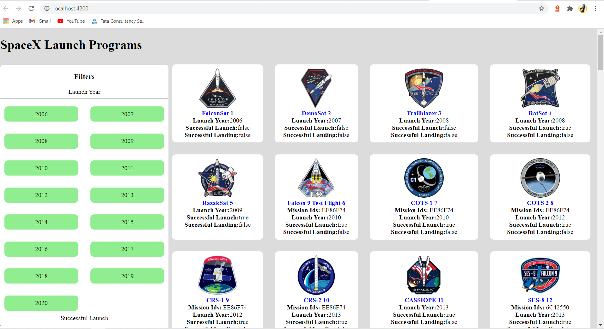

## Server-side rendering (SSR) with Angular Universal
cmd: ng add @nguniversal/spacex

The Angular CLI compiles and bundles the Universal version of the app with the Ahead-of-Time (AOT) compiler. A Node.js Express web server compiles HTML pages with Universal based on client requests
 
## Grid Implementation using CSS Grid Layout

## Desktop view

## Mobile View

## Tablet View

## Filter selection

## When data is not available

## Used Rxjs 
RxJS (Reactive Extensions for JavaScript) is a library for reactive programming using observables that makes it easier to compose asynchronous or callback-based code.

RxJS provides an implementation of the Observable type, which is needed until the type becomes part of the language and until browsers support it. The library also provides utility functions for creating and working with observables. These utility functions can be used for:

-Converting existing code for async operations into observables
-Iterating through the values in a stream
-Mapping values to different types
-Filtering streams
-Composing multiple streams

## LightHouse report

## Karma test runner output

## Test coverage

## SpaceX

This project was generated with [Angular CLI](https://github.com/angular/angular-cli) version 10.2.0.

## Development server

Run `ng serve` for a dev server. Navigate to `http://localhost:4200/`. The app will automatically reload if you change any of the source files.

## Code scaffolding

Run `ng generate component component-name` to generate a new component. You can also use `ng generate directive|pipe|service|class|guard|interface|enum|module`.

## Build

Run `ng build` to build the project. The build artifacts will be stored in the `dist/` directory. Use the `--prod` flag for a production build.

## Running unit tests

Run `ng test` to execute the unit tests via [Karma](https://karma-runner.github.io).

## Running end-to-end tests

Run `ng e2e` to execute the end-to-end tests via [Protractor](http://www.protractortest.org/).

## Further help

To get more help on the Angular CLI use `ng help` or go check out the [Angular CLI Overview and Command Reference](https://angular.io/cli) page.

